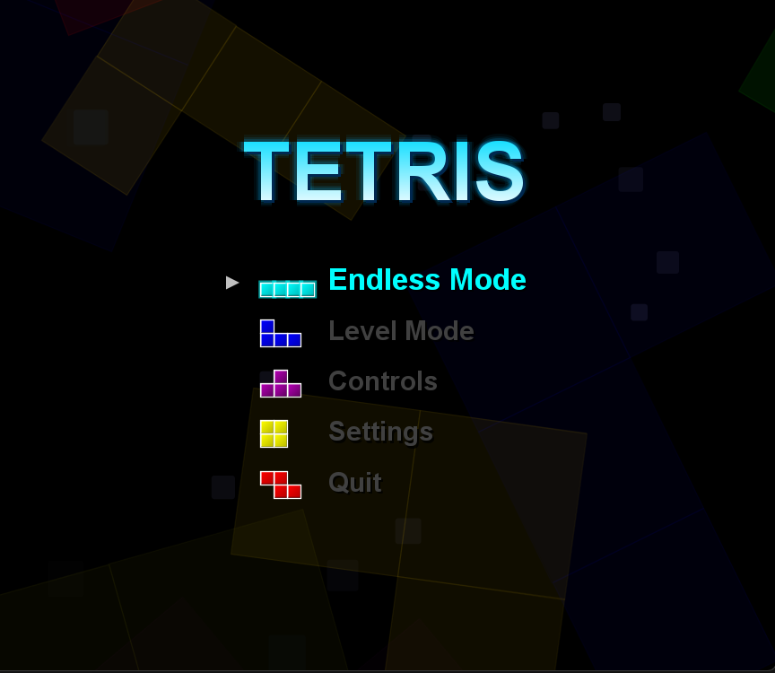
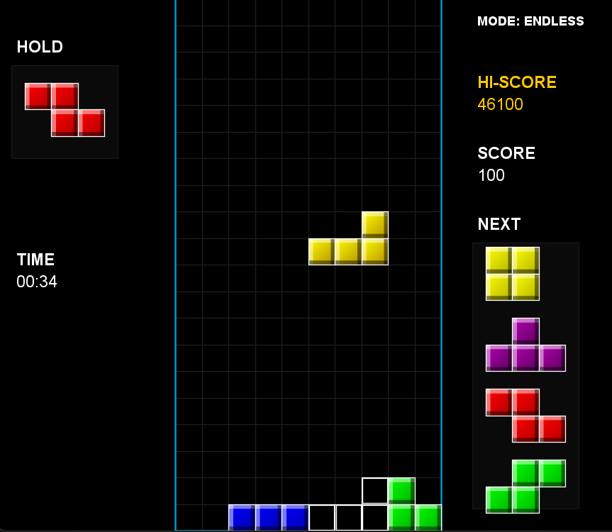
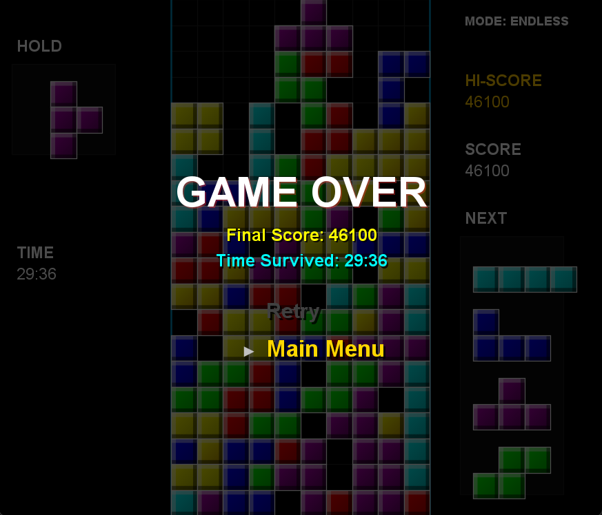

[English](#english) | [繁體中文](#繁體中文)

# English

# Tetris: Java Edition

A Tetris implementation developed in Java utilizing the standard AWT and Swing libraries. The project integrates standard Tetris mechanics, including the Super Rotation System (SRS), alongside a custom rendering implementation for block coloring and particle effects.

## System Features

### Core Mechanics
* **SRS (Super Rotation System)**: Computes wall kick data to permit block rotation near boundaries and internal object collisions.
* **Scoring Algorithm**: Calculates score multipliers processing T-Spin detection (3-corner verification) and continuous line clear operations (Combo system).
* **Control Implementation**: Supports continuous descent acceleration (Soft Drop), instant placement (Hard Drop), and block swapping (Piece Hold) functions.
* **Ghost Piece**: Computes and displays the lowest valid landing coordinate for the active block.
* **Game Modes**: Operates in Endless Mode and Level Mode (in which descent velocity scales with cleared lines).

### Graphics Rendering
* **Graphic Rendering System**: Utilizes `Graphics2D` and `GradientPaint` to calculate and render bevel geometry and shading dynamically.
* **Particle System**: Generates physics-based particle trajectories corresponding to Hard Drop events and line clear animations.
* **Interface Layout**: Implements a standard three-column grid distribution (Hold data, Matrix, Next Queue/Score data) alongside layered background rendering.

### Audio Processing
* **Asynchronous Audio Architecture**: Initializes discrete threads to handle Sound Effects (SFX) and Background Music (BGM) playback, preventing UI thread blocking.
* **Format Conversion Pipeline**: Dynamically down-samples 24-bit/32-bit audio files to 16-bit PCM format for compatibility with the native Java `Clip` wrapper.
* **State Machine Driven Audio**: Synchronizes BGM transitions with application states (Menu, Gameplay, Game Over).

### Software Architecture
* **MVC Pattern**: Completely decelerates state memory (`GameState`), visual output (`GamePanel`), and user input routing (`GameController`/`InputController`).
* **Game Loop Lifecycle**: Executes via a primary execution thread to decouple logical updates and frame repaints.

## Installation & Usage

### Prerequisites
* Java Runtime Environment (JRE) 8 or higher.

### Initialization
1. Clone the repository or extract the release archive.
2. Verify that `Tetris.jar` and the `sounds/` directory reside in the same root path.
3. Execute the binary via terminal or command prompt:
   ```bash
   java -jar Tetris.jar
   ```

### Input Mapping
* **Arrow Left / Right**: Translate horizontal coordinates
* **Arrow Up / X**: Rotate Clockwise
* **Z**: Rotate Counter-Clockwise
* **Arrow Down**: Soft Drop
* **Space**: Hard Drop
* **C**: Hold Piece
* **Escape**: Toggle Pause State
* **Enter**: Confirm Menu Selection

## UI Documentation

### Menu Interface

*Figure 1: Main menu module illustrating the structural layout and background rendering elements.*

### Gameplay Interface

*Figure 2: Active gameplay state demonstrating matrix grid rendering, ghost piece plotting, and particle generation upon block collision.*

### Terminating State

*Figure 3: Game Over module summarizing the cumulative score data and high score record persistence.*

---

<br>
<br>

# 繁體中文

# Tetris: Java Edition

以純 Java 開發並依賴 AWT 與 Swing 函式庫之俄羅斯方塊專案。本專案實作標準俄羅斯方塊核心機制（包含 SRS 系統），並建構自定義圖形渲染架構處理方塊色彩計算與粒子運算。

## 系統功能

### 核心機制
* **SRS 旋轉系統 (Super Rotation System)**：實作踢牆判定 (Wall Kick) 數據矩陣，處理邊界與障礙物附近之方塊旋轉碰撞。
* **計分演算法**：計算包含 T-Spin（透過 3-corner 驗證）以及 Combo 連續消除之分數乘數。
* **操控介面**：支援緩降 (Soft Drop)、瞬落 (Hard Drop) 以及方塊保留 (Piece Hold) 等標準輸入操作。
* **落點預測 (Ghost Piece)**：計算並顯示當前方塊於 Y 軸可到達之最低正確座標位置。
* **執行模式**：提供無盡模式 (Endless Mode) 與等級模式 (Level Mode，其重力常數隨等級遞增)。

### 圖形渲染
* **圖形渲染引擎**：導入 `Graphics2D` 與 `GradientPaint` 類別，動態計算並繪製方塊之切角高光與陰影數值。
* **粒子運算系統**：針對 Hard Drop 及消除指令，生成給定物理軌跡之粒子視覺反饋。
* **使用介面佈局**：建立三欄式網格排版（包含 Hold 區、主矩陣區、Next/分數存放區）及分層背景。

### 音訊處理
* **非同步音訊架構**：建立獨立執行緒處理音效 (SFX) 與背景音樂 (BGM) 之 I/O，以防主執行緒阻塞。
* **音訊格式轉換管線**：對於不受 Java原生 `Clip` 支援之 24-bit/32-bit 浮點音源，程式會動態將資料降轉為 16-bit PCM 格式。
* **狀態機驅動音訊**：BGM 將依據軟體之狀態機模式（選單、運行中、終止狀態）進行同步掛載與卸載。

### 軟體架構
* **MVC 設計模式**：解耦系統狀態記憶 (`GameState`)、視圖渲染 (`GamePanel`) 以及輸入邏輯收發 (`GameController`/`InputController`)。
* **邏輯迴圈排程**：透過主執行緒分離軟體邏輯更新頻率與畫面幀數刷新率。

## 安裝與起始

### 環境需求
* Java Runtime Environment (JRE) 8 及其後續版本。

### 執行步驟
1. 取得專案原始碼，或下載封裝完成之軟體包。
2. 確保 `Tetris.jar` 與 `sounds/` 目錄存在於相同之相對路徑下。
3. 於命令列介面執行以下指令：
   ```bash
   java -jar Tetris.jar
   ```

### 系統輸入對應
* **左 / 右方向鍵**：水平對應座標移動
* **上方向鍵 / X**：順時針矩陣旋轉
* **Z**：逆時針矩陣旋轉
* **下方向鍵**：Soft Drop 緩降
* **空白鍵 (Space)**：Hard Drop 瞬落
* **C**：Hold 方塊保留
* **Esc**：觸發/解除暫停狀態
* **Enter**：送出選單指令

## UI 介面參照

### 選單介面

*圖一：主選單模組，展示排版結構與底層背景渲染物件。*

### 運行介面

*圖二：運行中狀態，展示矩陣網格渲染、預測落點運算以及方塊碰撞所產生之粒子視覺化結果。*

### 結算介面

*圖三：系統終止畫面，匯總生命週期內之計分數據與歷史最高分紀錄寫入結果。*