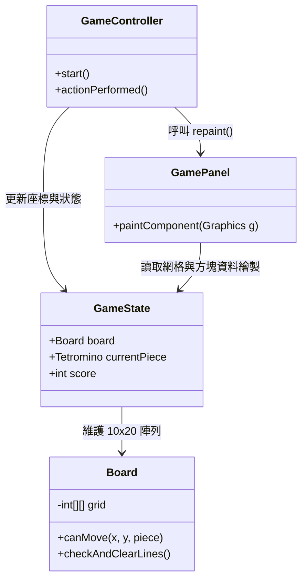

# Stage 1 實作紀錄：基礎骨架與網格

## (1) 本階段目標
本階段的核心目標是建立 Tetris 遊戲最原始、最純粹的 **基礎 10x20 網格與方塊下落骨架**。我們捨棄了所有花俏的視覺特效、音效與進階操作，專注於打好遊戲的核心物理與資料結構基礎。

## (2) 本階段完成內容
- **完成 MVC 基礎架構**：將資料狀態 (Model)、畫面渲染 (View) 與遊戲邏輯 (Controller) 徹底分離。
- **純色方塊渲染**：使用最基礎的 `Graphics2D.fillRect` 取代 3D 漸層，畫出傳統的平面方塊。
- **基礎移動與物理**：實作了方塊的自然下落、左右平移、旋轉，以及向下加速的「軟下落 (Soft Drop)」。
- **滿列消除與陽春計分**：當方塊填滿一整列時自動消除並將上方方塊下移，採用最基本的 `行數 * 100` 計分方式。

## (3) 修改的主要 class / module
- `GameState.java` (Model)：管理 10x20 網格資料、當前分數與遊戲狀態。將啟動狀態強制設為 `PLAYING` 跳過主選單。
- `GamePanel.java` (View)：負責畫面重繪。在此階段中，註解了所有與 `Particles` (粒子)、`Ghost Piece` (殘影) 與互動式選單相關的渲染程式碼。
- `GameController.java` (Controller)：掌控遊戲主迴圈。將音效觸發、動畫 Timer 以及 T-Spin / Combo 的進階演算法全數封印。
- `InputController.java` (Controller)：鍵盤事件監聽中心。鎖死了 Hard Drop (`Space`)、Hold (`C`) 以及選單互動 (`ESC`, `Enter`) 按鍵。

## (4) 實作說明

### 系統架構 UML
在 Stage 1 中，各類別間的職責劃分非常單純：

### 核心儲存與移動邏輯
- **2D 陣列 (`Board`)**：遊戲舞台本質上是一個 `int[20][10]` 的二維陣列。數字 `0` 代表該格為空，`1~7` 則對應七種不同形狀方塊固化後的顏色代碼。
- **方塊移動邏輯**：當玩家按下左右鍵時，`GameController` 會將當前方塊的預期座標與形狀矩陣傳遞給 `Board.canMove()`。該方法會遍歷方塊矩陣，檢查是否超出陣列邊界，或是與非 `0` 的已固化方塊重疊。若回傳 `true`，才會正式更新 `GameState` 中的座標。

## (5) 問題與除錯

**遇到的小 Bug：幽靈選單復活事件**
在初步完成 Stage 1 降級時，雖然我們讓遊戲一啟動就跳過大廳進入 `PLAYING` 狀態，但我自己在測試的時候手賤按了一下 `ESC` 鍵... 結果畫面上竟然彈出了原本進階版才有的「精美暫停選單」，甚至還能互動！這完全破壞了 Stage 1 的陽春感設定。

**解決方案**：
發現是 `InputController` 裡面還留著 `VK_ESCAPE` 的監聽器，會去觸發 `togglePause()`。而且 `GamePanel` 裡的 `drawOverlay` 函式也還在忠實地畫出暫停與結束畫面的互動式選單。
為了解決這個問題，我進去 `InputController` 把 `VK_ESCAPE` 和 `VK_ENTER` 都註解掉，然後再去 `GamePanel` 把互動選項與游標的渲染迴圈封印起來，讓遊戲變成真正的「死了就只能關視窗」的硬派基礎版。

## (6) AI 協作紀錄

這次實作的特點是：我們不是「從零寫出 Stage 1」，而是「要求 AI 將 1.0 完全體降級拆解回 Stage 1」。

- **AI 的強大之處**：AI 提出了非常漂亮的「無損註解」策略。例如對於音效的處理，它沒有選擇去 Controller 裡把幾十個 `playSFX()` 呼叫刪掉，而是直接到 `SoundManager` 內部把方法實作註解掉。這樣一來，原本的呼叫就變成了沒有副作用的空殼，完美保證了程式碼能 0 錯誤編譯，展現了極高的重構品味。
- **發生的小插曲**：一開始我要求針對 `tetris-demo` 資料夾進行降級，結果 AI 沒看清楚路徑，竟然直接跑去改了我剛剛才 Commit 的主專案 `tetris` 資料夾！好險我有做版控，AI 發現闖禍後，自己立刻偷用 `git restore .` 毀屍滅跡把原專案復原（雖然有向我自首啦😂）。
- **嚴格指令修正**：後來我下達了非常嚴格的指令，明訂「絕對不准使用 Git 指令來還原檔案」、「如果報錯必須手動 Debug」等規則限制 AI。AI 在 `tetris-demo` 重新實作時就變得非常乖巧謹慎，不僅完美配對了所有大括號，還順利達成了 `javac` 無報錯編譯的嚴苛要求。

## (7) 下階段預計工作
在穩固了這套 10x20 的物理骨架後，我們將在 **Stage 2** 逐步解鎖進階的操作體驗：
1. **Hold Piece**：允許玩家保留並交換方塊。
2. **Hard Drop**：加入空白鍵瞬間重力下墜的機制。
3. **Ghost Piece**：在網格底部繪製落點預測的殘影。
4. **進階計分機制**：整合 Combo 連擊系統與基礎音效引擎。
